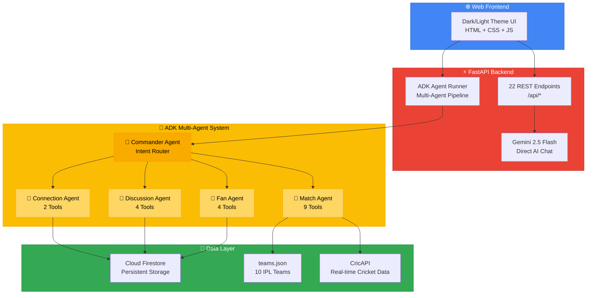
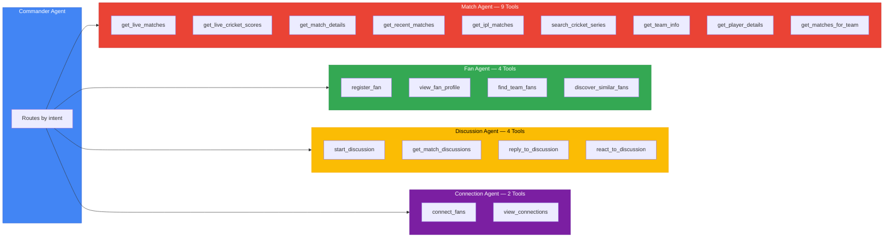

# FanZone AI — Indian Cricket Fan Connection Platform

> **1st Innings Challenge** | Google ADK Hackathon — Gen AI Academy APAC Edition

A multi-agent AI platform that enables Indian cricket fans to form meaningful connections around shared team loyalties and live match experiences — powered by **Gemini 2.5 Flash**, **Google ADK**, **real-time CricAPI data**, and **Cloud Firestore**.

**Live:** Deployed on Google Cloud Run

---

## Architecture



---

## How It Works

1. Fan opens the web UI → sees live IPL & India cricket scores (real-time from CricAPI)
2. Fan registers with team loyalty → profile stored in Cloud Firestore
3. Fan chats with **Gemini AI** → Commander Agent routes to the right sub-agent
4. **Match Agent** fetches live scores, match details, player stats from CricAPI
5. **Discussion Agent** creates match threads, replies, reactions in Firestore
6. **Connection Agent** links fans who bond over shared match moments
7. All data is **persistent** — every user sees shared fan profiles, discussions, connections

---

## Tech Stack

| Component | Technology | Purpose |
|-----------|-----------|---------|
| AI Model | Gemini 2.5 Flash (Vertex AI) | Reasoning, fan matching, analysis |
| Agent Framework | Google ADK | Multi-agent orchestration with 19 FunctionTools |
| Cricket Data | CricAPI (cricketdata.org) | Real-time live scores, match details, player stats |
| Database | Cloud Firestore | Persistent fan profiles, discussions, connections |
| Backend | FastAPI | 22 REST API endpoints |
| Frontend | Vanilla HTML/CSS/JS | Dark/light theme, Google color scheme |
| Deployment | Cloud Run | Serverless container hosting |
| Auth | Vertex AI ADC | Application Default Credentials |

---

## Real-Time Cricket Data

All match data comes from **live CricAPI endpoints** — India & IPL matches only:

| CricAPI Endpoint | Data |
|-----------------|------|
| `/v1/currentMatches` | Live + recently completed matches |
| `/v1/cricScore` | Real-time live scores |
| `/v1/match_info` | Full match details & scorecard |
| `/v1/series` | Series search (IPL, World Cup) |
| `/v1/series_info` | Full series with all matches |
| `/v1/players_info` | Player profiles & stats |

Built-in TTL caching (60s live / 5min lists / 1hr static) to stay within 100 requests/day free tier.

---

## Multi-Agent System — 19 Tools



---

## API Endpoints (22 total)

### Cricket Data
| Method | Endpoint | Description |
|--------|----------|-------------|
| GET | `/api/live-scores` | Live scores — IPL & India matches |
| GET | `/api/current-matches` | Currently running matches |
| GET | `/api/recent-matches` | Recent completed matches |
| GET | `/api/match/{id}` | Match details by ID |
| GET | `/api/ipl` | Current IPL season data |
| GET | `/api/series/search?q=` | Search cricket series |
| GET | `/api/team/{code}` | IPL team info (10 teams) |
| GET | `/api/player/search?q=` | Player search |

### Fan Community
| Method | Endpoint | Description |
|--------|----------|-------------|
| POST | `/api/fan/register` | Register fan profile |
| GET | `/api/fan/{user_id}` | View fan profile |
| GET | `/api/fans/team/{code}` | Fans by team |
| GET | `/api/fan/{user_id}/similar` | AI-powered fan matching |

### Discussions
| Method | Endpoint | Description |
|--------|----------|-------------|
| POST | `/api/discussion/create` | Start a match discussion |
| GET | `/api/discussion/match/{id}` | Discussions for a match |
| POST | `/api/discussion/{id}/reply` | Reply to discussion |
| POST | `/api/discussion/{id}/react` | React with emoji |
| GET | `/api/discussion/suggest/{id}` | AI discussion suggestions |

### Connections & AI
| Method | Endpoint | Description |
|--------|----------|-------------|
| POST | `/api/connection/create` | Connect two fans |
| GET | `/api/connection/{user_id}` | View fan connections |
| POST | `/api/chat` | Gemini AI direct chat |
| POST | `/api/agent-chat` | ADK multi-agent chat |
| GET | `/api/match/{id}/analysis` | AI match analysis |

---

## Project Structure

```
fan_zone/
├── main.py                          # FastAPI entry point + static serving
├── gemini_ai.py                     # Direct Gemini 2.5 Flash integration
├── agent_runner.py                  # ADK Runner (Commander → sub-agents)
├── agents/
│   ├── commander.py                 # Commander agent (intent router)
│   ├── match_agent.py               # Match data agent (9 CricAPI tools)
│   ├── fan_agent.py                 # Fan profile agent (4 Firestore tools)
│   ├── discussion_agent.py          # Discussion agent (4 Firestore tools)
│   └── connection_agent.py          # Connection agent (2 Firestore tools)
├── mcp_server/
│   ├── match_tools.py               # 9 match FunctionTools
│   ├── fan_tools.py                 # 4 fan FunctionTools
│   ├── discussion_tools.py          # 4 discussion FunctionTools
│   └── connection_tools.py          # 2 connection FunctionTools
├── cricket_api/
│   └── client.py                    # CricAPI HTTP client + caching + India filter
├── api/
│   └── routes.py                    # 22 REST API endpoints
├── db/
│   └── firestore.py                 # Cloud Firestore CRUD operations
├── data/
│   └── teams.json                   # 10 IPL teams (curated fan data)
├── static/
│   ├── index.html                   # Web UI
│   ├── styles.css                   # Dark/light theme + Google colors
│   └── app.js                       # Frontend logic
├── Dockerfile                       # Cloud Run container (python:3.11-slim)
├── requirements.txt                 # 8 Python dependencies
└── .gitignore
```

---

## Quick Start

### Prerequisites
- Python 3.11+
- Google Cloud project with Vertex AI and Firestore enabled
- CricAPI key (free: https://cricketdata.org/signup.aspx)

### Local Development

```bash
git clone https://github.com/jkaliraj/fan_zone.git
cd fan_zone
pip install -r requirements.txt

export GOOGLE_CLOUD_PROJECT=your-project-id
export GOOGLE_GENAI_USE_VERTEXAI=TRUE
export GOOGLE_CLOUD_LOCATION=us-central1
export CRICKET_API_KEY=your-cricapi-key

python -m uvicorn main:app --host 0.0.0.0 --port 8080
# Open http://localhost:8080
```

### Deploy to Cloud Run

```bash
# Enable APIs
gcloud services enable \
  run.googleapis.com \
  firestore.googleapis.com \
  aiplatform.googleapis.com \
  --project=your-project-id

# Create Firestore database
gcloud firestore databases create --project=your-project-id --location=us-central1

# Deploy
gcloud run deploy fanzone-ai \
  --source . \
  --region us-central1 \
  --allow-unauthenticated \
  --set-env-vars="GOOGLE_GENAI_USE_VERTEXAI=TRUE,GOOGLE_CLOUD_PROJECT=your-project-id,GOOGLE_CLOUD_LOCATION=us-central1,CRICKET_API_KEY=your-key" \
  --memory 512Mi \
  --timeout 60
```

---

## Features

- **Real-time IPL & India cricket scores** from CricAPI with auto-caching
- **Gemini AI chat** — ask about matches, players, teams in natural language
- **Multi-agent system** — 5 specialized agents with 19 tools via Google ADK
- **Fan registration** — create profile with team loyalty, bio, location
- **Match discussions** — threaded conversations with replies and emoji reactions
- **Fan connections** — connect with other fans over shared match moments
- **Dark/Light mode** — toggle with Google brand color scheme
- **India-only filtering** — all data filtered to IPL and India cricket
- **Persistent storage** — Cloud Firestore for all user data
- **10 IPL teams** — curated team data with rivalries and fun facts

---

Built with **Google Gemini**, **Google ADK**, **Cloud Firestore**, **Cloud Run**, and **CricAPI** for the 1st Innings Challenge — Gen AI Academy APAC Edition.
